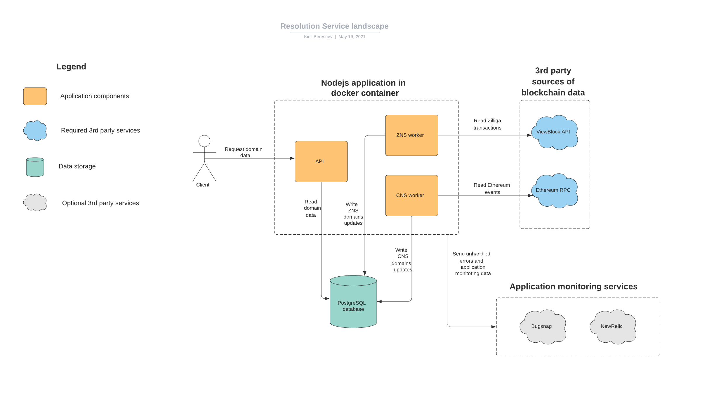

# Resolution service


[](https://docs.unstoppabledomains.com/)
[](https://discord.gg/b6ZVxSZ9Hn)

- [Installation](README.md#installation)
  - [Pre-requirements](README.md#pre-requirements)
  - [Quick start](README.md#quick-start)
- [Running the service](README.md#running-the-service)
  - [Environment configuration options](README.md#environment-configuration-options)
  - [Running modes](README.md#running-modes)
  - [API reference](README.md#api-reference)
- [Development notes](README.md#development-notes)

Resolution service provides an API for getting domain data and metadata
regardless of that domain's location (whether it is stored in Ethereum, Zilliqa,
or any other blockchain). The service is used to cache blockchain events in a
database for easy retrieval without acessing blockchain APIs.

The resolution service is provided as a docker image so it can be launched on a
variety of platforms and in the cloud.

## Resolution service endpoints
- Production: http://resolve.unstoppabledomains.com/api-docs/

## Installation

### Pre-requirements

- **git** - to clone the repository.
- **docker** - to run the service. Install docker by following
  [instructions](https://docs.docker.com/engine/install/) for an appropriate
  system.
- **postgres** - to store the data. Postgres can be configured on the same
  server as the resolution service or on a dedicated database hosting (e.g. AWS
  RDS, Google Cloud SQL). To install postgres locally, follow these
  [instructions](https://www.postgresql.org/download). Make sure to configure
  password authentication for the DB user that will be used by the service.

### Quick start

1. Clone the resolution-service repository\
   `git clone https://github.com/unstoppabledomains/resolution-service.git`
2. Build the docker container\
   `docker build -t resolution-service .`
3. Setup environment variables\
   Create a file `service.env` that will contain required environment variables:

```
NODE_ENV=production
RESOLUTION_POSTGRES_HOST=example.com:5432      # DB host
RESOLUTION_POSTGRES_USERNAME=example           # DB user configured in postgres
RESOLUTION_POSTGRES_PASSWORD=password          # DB password configured in postgres
RESOLUTION_POSTGRES_DATABASE=resolution_service # Name of the resolution service database
ETHEREUM_JSON_RPC_API_URL=https://alchemy.com  # Address of a JSON RPC provider. This can be a public API (e.g. Alchemy), or a local ethereum node with JSON RPC enabled
POLYGON_JSON_RPC_API_URL=https://alchemy.com   # Address of a JSON RPC provider. This can be a public API (e.g. Alchemy), or a local ethereum node with JSON RPC enabled
VIEWBLOCK_API_KEY=apikey                       # Key for Viewblock API, required for getting data from Zilliqa blockchain
METADATA_BASE_URI=http://localhost:3000        # Base URL for ERC721 metadata endpoints
```

This is the minimum required set of configurations for the service. Additional
configuration options are listed in
[Environment configuration options](README.md#environment-configuration-options).

4. Setup postgres database.
   - Connect to a postgres instance using the psql console\
     `psql --host=HOSTNAME --username=USERNAME`
   - Create the `resolution_service` database\
     `createdb resolution_service`
5. Launch the service\
   `docker run -d --env-file service.env -p 3000:3000 --network="host" resolution-service`

## Running the service

Once the service is started, it will perform initial synchronization with the
blockchain networks. It may take more than 24 hours for a full synchronization.
During the initial synchronization the API may not work reliably. The status of synchronization can be checked
using the `/status` endpoint. After the synchronization is complete, the service
API endpoints can be accessed normally. Note that the service is stateless, so
the container doesn't need any persistent storage. All data is stored in the
database.

### Environment configuration options

| Option                                      | Default value                                        | required           | Description                                                                                                                                                                                                                                                                                                                 |
| ------------------------------------------- | ---------------------------------------------------- | ------------------ | --------------------------------------------------------------------------------------------------------------------------------------------------------------------------------------------------------------------------------------------------------------------------------------------------------------------------- |
| RESOLUTION_API_PORT                         | 3000                                                 | :x:                | The port for the HTTP API.                                                                                                                                                                                                                                                                                                  |
| RESOLUTION_RUNNING_MODE                     | API,ETH_WORKER,MATIC_WORKER,ZIL_WORKER,MIGRATIONS                 | :x:                | Comma-separated list of running modes of the resolution service (see [Running modes](README.md#running-modes)).                                                                                                                                                                                                             |
| RESOLUTION_POSTGRES_HOST                    | localhost                                            | :heavy_check_mark: | Host for the postgres DB. Note that to connect to a postgres instance running on the same server as the container, `host.docker.internal` should be used instead of `localhost` on Windows and MacOS (see https://docs.docker.com/docker-for-windows/networking/#use-cases-and-workarounds).                                |
| RESOLUTION_POSTGRES_USERNAME                | postgres                                             | :heavy_check_mark: | Username that is used to connect to postgres.                                                                                                                                                                                                                                                                               |
| RESOLUTION_POSTGRES_PASSWORD                | secret                                               | :heavy_check_mark: | Password that is used to connect to postgres.                                                                                                                                                                                                                                                                               |
| RESOLUTION_POSTGRES_DATABASE                | resolution_service                                   | :heavy_check_mark: | Database name in postgres.                                                                                                                                                                                                                                                                                                  |
| RESOLUTION_POSTGRES_PORT                    | 5432                                                 | :x:                | Port number for Postgres database.                                                                                                                                                                                                                                                                                          |
| ETHEREUM_CONFIRMATION_BLOCKS                | 20                                                    | :x:                | Number of blocks that the service will wait before accepting an event from the CNS contract. This helps to avoid block reorgs, forks, etc.                                                                                                                                                                                  |
| ETHEREUM_BLOCK_FETCH_LIMIT                  | 500                                                 | :x:                | Batch limit for fetching event data from the Ethereum JSON RPC. Note that some API providers may limit the amount of data that can be returned in a single request. So this number should be kept relatively low. However, raising this limit should speed up synchronization if a dedicated node is used with the service. |
| ETHEREUM_RECORDS_PER_PAGE                   | 100                                                  | :x:                | Batch limit for fetching domain records from CNS registry smart contract.                                                                                                                                                                                                                                                   |
| ETHEREUM_FETCH_INTERVAL                     | 5000                                                 | :x:                | Specifies the interval to fetch data from the CNS registry in milliseconds.                                                                                                                                                                                                                                                 |
| CNS_REGISTRY_EVENTS_STARTING_BLOCK          | 9080000                                              | :x:                | Starting block that is used to look for events in the CNS registry. This helps to avoid parsing old blockchain data, before the contract was even deployed.                                                                                                                                                                 |
| CNS_RESOLVER_ADVANCED_EVENTS_STARTING_BLOCK | 9080000                                              | :x:                | Starting block that is used to look for events in the CNS registry.                                                                                                                                                                                                                                                         |
| ETHEREUM_ACCEPTABLE_DELAY_IN_BLOCKS         | 100                                                  | :x:                | How much blocks Ethereum mirror can lag behind until it's considered as unacceptable and need to be fixed. /status endpoint will return `health: true/false` field depends on number of blocks behind compared with this number.                                                                                            |
| ETHEREUM_JSON_RPC_API_URL                   | -                                                    | :heavy_check_mark: | Address of a JSON RPC provider. This can be a public API (e.g. Alchemy), or a local ethereum node with JSON RPC enabled.                                                                                                                                                                                                    |
| ETHEREUM_NETWORK_ID                         | 1                                                    | :x:                | ID of the Ethereum network that is used by the service.                                                                                                                                                                                                                                                                     |
| POLYGON_CONFIRMATION_BLOCKS                | 20                                                    | :x:                | Number of blocks that the service will wait before accepting an event from the smart contracts on Polygon. This helps to avoid block reorgs, forks, etc.                                                                                                                                                                                  |
| POLYGON_BLOCK_FETCH_LIMIT                  | 500                                                 | :x:                | Batch limit for fetching event data from the Polygon JSON RPC. Note that some API providers may limit the amount of data that can be returned in a single request. So this number should be kept relatively low. However, raising this limit should speed up synchronization if a dedicated node is used with the service. |
| POLYGON_RECORDS_PER_PAGE                   | 100                                                  | :x:                | Batch limit for fetching domain records from Polygon smart contracts.                                                                                                                                                                                                                                                   |
| POLYGON_FETCH_INTERVAL                     | 5000                                                 | :x:                | Specifies the interval to fetch data from the Polygon blockchain in milliseconds.                                                                                                                                                                                                                                                 |
| POLYGON_UNS_REGISTRY_EVENTS_STARTING_BLOCK          | 19345077                                              | :x:                | Starting block that is used to look for events in the UNS registry on the Polygon blockchain. This helps to avoid parsing old blockchain data, before the contract was even deployed.                                                                                                                                                                 |
| POLYGON_ACCEPTABLE_DELAY_IN_BLOCKS          | 100                                                  | :x:                | How much blocks Polygon mirror can lag behind until it's considered as unacceptable and need to be fixed. /status endpoint will return `health: true/false` field depends on number of blocks behind compared with this number.                                                                                             |
| POLYGON_JSON_RPC_API_URL                    | -                                                    | :heavy_check_mark: | Address of a Polygon JSON RPC provider. This can be a public API (e.g. Alchemy), or a local ethereum node with JSON RPC enabled.                                                                                                                                                                                            |
| POLYGON_NETWORK_ID                          | 137                                                  | :x:                | ID of the Polygon network that is used by the service.                                                                                                                                                                                                                                                                      |
| ZNS_NETWORK                                 | mainnet                                              | :x:                | Name of the Zilliqa network will be used by ZNS worker (mainnet or testnet).                                                                                                                                                                                                                                                |
| VIEWBLOCK_API_KEY                           | -                                                    | :heavy_check_mark: | API key for [viewblock](https://viewblock.io/api), required by ZNS worker.                                                                                                                                                                                                                                                  |
| ZNS_FETCH_INTERVAL                          | 5000                                                 | :x:                | Specifies the interval to fetch data from the ZNS registry in milliseconds.                                                                                                                                                                                                                                                 |
| NEW_RELIC_LICENSE_KEY                       | -                                                    | :x:                | License key that will be used to access newrelic. If the key is not specified, new relic will not be enabled.                                                                                                                                                                                                               |
| NEW_RELIC_APP_NAME                          | -                                                    | :x:                | App name will be used to access newrelic. If the app name is not specified, new relic will not be enabled.                                                                                                                                                                                                                  |
| BUGSNAG_API_KEY                             | -                                                    | :x:                | API key that will be used to access bugsnag. If the key is not specified, bugsnag will not be enabled.                                                                                                                                                                                                                      |
| TYPEORM_LOGGING_COLORIZE                    | true                                                 | :x:                | Colorize typeorm logs.                                                                                                                                                                                                                                                                                                      |
| ZILLIQA_ACCEPTABLE_DELAY_IN_BLOCKS              | 100                                                  | :x:                | How much blocks Zilliqa mirror can lag behind until it's considered as unacceptable and need to be fixed. /status endpoint will return `health: true/false` field depends on number of blocks behind compared with this number.                                                                                             |
| METADATA_BASE_URI                | -                                   | :heavy_check_mark: | Base URL for ERC721 metadata endpoints                                                                                                                                                                                                                                                                                                  |

### Running modes

The service provides several running modes. By default it will run all of them.
However, the modes that will be used can be selected during startup using the
RESOLUTION_RUNNING_MODE environment variable. Available running modes:

- **API** - Runs the service API.
- **ETH_WORKER** - Runs the ETH worker to sync data from the Ethereum CNS and
  UNS registry
- **MATIC_WORKER** - Runs the MATIC worker to sync data from the Polygon UNS registry
- **ZIL_WORKER** - Runs the ZIL worker to sync data from the Zilliqa ZNS
  registry
- **MIGRATIONS** - Runs the migration scripts if necessary.

For example, to run only the `API` with the `ETH_WORKER`, the following
environment configuration can be used:

```
RESOLUTION_RUNNING_MODE=API,ETH_WORKER
```

### API keys

The `/domains` API requires an API key which is simply a version 4 UUID. Currently there are no key management functions in the resolution service. All API keys must be added manually using the database. To generate a random API key run the following query in postgres:

``` sql
 INSERT INTO api_keys (name, api_key) VALUES ('my API key', md5(clock_timestamp()::text)::uuid);
```

> Note: The above example should not be used for production API keys as the key which is based on a predictable value. Production keys should be generated externally.

## API reference

The full api reference
[OpenAPI specification](http://resolve.unstoppabledomains.com/api-docs/)

| Endpoint                      | Description                                                      |
| ----------------------------- | -----------------------------------------------------------------|
| GET /domains                  | Gets the list of domains.                                        |
| GET /domains/:domainName      | Gets the resolution of the specified domain.                     |
| GET /metadata/:domainOrToken  | Retrieve erc721 metadata information of the specified domain     |
| GET /image/:domainOrToken     | Retrieve image_data as a svg string                              |
| GET /image-src/:domainOrToken | Retrieve image_data as 'image/svg+xml'                           |
| GET /status                   | Gets the synchronization status.                                 |
| GET /api-docs                 | Returns a swagger documentation page.                            |

> Note: The `/domains` endpoints require an API key. The key must be provided as `Bearer` authentication header for requests. New keys must be added manually to the database (see [API keys](#api-keys) for more info).

## Development notes

### Development pre-requirements

The dev. environment has generally the same pre-requirements as running the
service normally. So, postgres and docker are also necessary. For convenience
postgres configuration can be the same as defaults (username - postgres,
password - secret).

Additional pre-requirements that are necessary for development:

- Node.JS 14.16.1
  Can be installed using [NVM](https://github.com/nvm-sh/nvm)
- [yarn](https://yarnpkg.com/lang/en/docs/install)

### Running in dev. mode

1. Install project dependencies

```
nvm use 14.16.1
yarn install
```

2. Configure environment variables.\
   The required variables are the same as running the service in docker. To simplify
   development it's recommended to set additional ENV variables mentioned in `./local.dev.env`
   file.

```
RESOLUTION_POSTGRES_HOST=localhost
RESOLUTION_POSTGRES_USERNAME=postgres
RESOLUTION_POSTGRES_PASSWORD=password
RESOLUTION_POSTGRES_DATABASE=resolution_service
ETHEREUM_JSON_RPC_API_URL=localhost:8545
POLYGON_JSON_RPC_API_URL=localhost:8546
VIEWBLOCK_API_KEY=apikey
```

3. Run the service

```
yarn start:dev
```

### Running unit tests

Unit tests can be run using `yarn test`. This command will run the tests with
ENV variables set in `./local.test.env` file. You could redefine any env
variable in yours local environment if needed, for example:
`export RESOLUTION_POSTGRES_PASSWORD=password`. Testing command will take this
variable first instead of using variable from `./local.test.env` file.

For checking coverage use `yarn test:coverage`.

Unit/integration tests use a postgres database that is cleaned before each test.
By default, the database name is `resolution_service_test`.

### Service architecture



The service currently consists of three main components: API, and three workers.
The API component is a basic HTTP API that allows reading domain data from the
database. The OpenAPI specification:
[OpenAPI specification](http://resolve.unstoppabledomains.com/api-docs/).

Currently there are two workers in the resolution service:

- ETH worker\
  Contains a scheduled job that connects to the Ethereum blockchain using JSON RPC
  and pulls CNS (.crypto) and UNS domains and resolution events. The events are parsed
  and saved to the database.
- MATIC worker\
  Contains a scheduled job that connects to the Polygon blockchain using JSON RPC
  and pulls domains and resolution events. The events are parsed
  and saved to the database.\
  Since Polygon and Ethereum are compatible, we use two instances of the same worker implementation to pull data from these networks.
- ZIL worker\
  Contains a scheduled job that connects to the Zilliqa blockchain using and pulls
  ZNS (.zil) domains and resolution events. The events are parsed and saved to the
  database.

More workers may be added in the future.

### Logs and monitoring

The resolution service outputs logs to `stdout` so they are available by
`docker logs` and can be monitored by cloud tools (e.g. AWS CloudWatch or Google
Cloud Logging). The general log format should be:
`<timestamp> <log level>: <Component label> - <Log message>`

The resolution service has a configurable logging level. Log messages are at
consistent levels across the whole service. We use the following guidelines to
determine logging level: 

Event|Component|description|log level
-----|---------|-----------|--------- 
Startup info|all|Log any startup information (e.g. worker is starting, API is listening)|info
Sync progress|Workers|Log current sync progress of a worker (which blocks are being processed, how many blocks are left to process)|info
Handled errors|all|Log any errors that can be handled gracefully (e.g. a malformed request that will return a 400 error)|warn
Unhandled errors|all|Log any errors that were captured by top-level error handlers (e.g. an unexpected third-party API error, invalid db state)|error
API Request|API controllers|Log any request to the API with their parameters|debug
DB query|all|Log any db queries with their parameters|debug
Parsed event|Workers|Log any event or transaction parsed by the worker|debug
External API calls|all|Log external API calls|debug

Additionally, if the appropriate keys are provided in the environment
configuration, the service will report errors to monitoring tools. The
resolution service has integrations with [bugsnag](https://www.bugsnag.com/) and
[newrelic](https://newrelic.com/).
